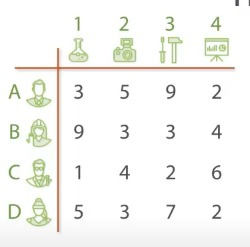

# Le problème d'assignation :**``The Assignment Problem``** 

## 1. **Description:**

- Le problème d'assignation, également connu sous le nom de problème d'assignation quadratique ou problème d'assignation de coût minimum, est un problème d'optimisation combinatoire dans lequel l'objectif est d'assigner un ensemble des tâches  à un ensemble des  personnes de manière à minimiser le coût total de l'assignation , Chaque tâche doit être assigné exactement une fois .

## 2. Principe de Solution :

[lien video](https://youtu.be/v-BpbaDW6QI?si=xKw6tnRO58_54g8Z)

Voici comment vous pourriez appliquer l'algorithme Branch and Bound pour résoudre le problème d'assignation :

1. **Initialisation :**
   - Créez une solution partielle initiale .
   - Initialisez une borne supérieure initiale avec une valeur très grande.
   - Calculez une borne inférieure initiale en utilisant une heuristique (par exemple, la méthode de l'arbre de couverture maximale).

2. **Boucle principale :**
   - Tant que la file de priorité n'est pas vide,
     - Retirez le prochain sous-problème de la file de priorité.
     - Vérifiez s'il est possible d'élaguer le sous-problème (borne inférieure plus grande que la borne supérieure actuelle).
     - Si le sous-problème ne peut pas être élagué, effectuez un branchement en ajoutant une nouvelle assignation (variable fixée).
     - Mettez à jour la file de priorité avec les nouveaux sous-problèmes.

3. **Terminaison :**
   - L'algorithme se termine lorsque la file de priorité est vide.

4. **Résultat :**
   - La meilleure solution trouvée est la solution partielle associée à la meilleure borne supérieure.