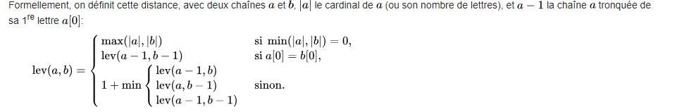
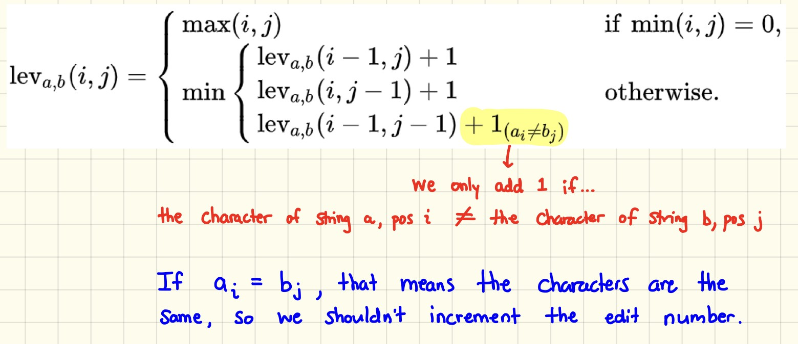

# cour : la distance de levenshtein


## 1. Définition :

- **Déf:**

- La distance de **Levenshtein**, également connue sous le nom de **distance d'édition**, est une mesure de la similarité entre deux chaînes de caractères.

- Cette mesure quantifie le nombre minimum d'opérations nécessaires pour transformer une chaîne en une autre. 

- Ces opérations sont  des **insertions**, des **suppressions** et des **substitutions** de caractères.

- La distance de Levenshtein est couramment utilisée en informatique, en particulier dans des domaines tels que la correction orthographique, la recherche d'approximation de chaînes de caractères et la bioinformatique pour comparer des séquences génétiques.

- **les opérations :**

    1. **Insertion** :
    - L'opération d'insertion consiste à ajouter un caractère dans une chaîne pour la rendre identique à l'autre chaîne.
    - Exemple : Pour transformer "chien" en "chienne", l'opération d'insertion est d'ajouter le caractère 'e' à la position appropriée, et cela a un coût de 1.

    2. **Suppression** :
    - L'opération de suppression consiste à supprimer un caractère d'une chaîne pour la rendre identique à l'autre chaîne.
    - Exemple : Pour transformer "chienne" en "chien", l'opération de suppression est de retirer le caractère 'n' de la position appropriée, et cela a un coût de 1.

    3. **Substitution** :
    - L'opération de substitution consiste à remplacer un caractère par un autre caractère dans une chaîne pour la rendre identique à l'autre chaîne.
    - Exemple : Pour transformer "chat" en "chien", l'opération de substitution est de remplacer 'a' par 'i' à la position appropriée, et cela a un coût de 1.

- **calcul :**

    - Pour calculer la distance de Levenshtein entre deux chaînes, vous comptez le nombre total d'opérations nécessaires (insertions, suppressions et substitutions) pour les transformer l'une en l'autre .

    - Chaque opération a un coût de 1. 

    - La distance de Levenshtein est le nombre minimum d'opérations nécessaires pour effectuer cette transformation.


.

## 2. formulation mathématique :

- soient `a` et `b` deux chaines .

- on note `|a|`  la cardinale de a .


donc ona : 


$$
\begin{equation}
lev(a,b) = 
\begin{cases}
    max(|a| , |b|) ~~ si ~~ min(|a| ,|b|) = 0 \\ 
    \\
    lev(a[:len(a)-1] , b[:len(b) - 1]) ~~~si ~~a[len(a)-1]=b[len(b) - 1] \\
    \\
    1 + min(lev(a-1,b) , lev(a, b-1) , lev(a -1 , b-1))
\end{cases}
\end{equation}
$$




## 3. la matrice de levenshtein :

- La matrice de Levenshtein est une structure de données qui est  utilisée pour calculer la distance de Levenshtein entre deux chaînes de caractères. 

- Cette matrice est une grille rectangulaire où les lignes représentent les caractères de la première chaîne et les colonnes représentent les caractères de la deuxième chaîne.


- Pour construire cette matrice, suivez ces étapes :

1. Créez une matrice de dimensions `(len(str1) + 1, len(str2) + 1)`, où `str1` et `str2` sont les deux chaînes que vous comparez.

2. Initialisez la première ligne et la première colonne de la matrice de la manière suivante :
   - La première ligne doit être initialisée avec les nombres de 0 à `len(str2)`. Cela représente le coût d'insertion pour transformer une chaîne vide en `str2`.
   - La première colonne doit être initialisée avec les nombres de 0 à `len(str1)`. Cela représente le coût de suppression pour transformer `str1` en une chaîne vide.

3. Parcourez la matrice, case par case, en remplissant les valeurs en utilisant la formule suivante :

   - Si les caractères correspondants dans `str1` et `str2` sont les mêmes, la valeur de la case est égale à la valeur de la case diagonale supérieure gauche.

   - Sinon, la valeur de la case est le minimum des trois nombres suivants :
     - La valeur de la case à gauche  (coût de suppression) + 1.
     - La valeur de la case au-dessus  (coût d'insertion) + 1.
     - La valeur de la case diagonale supérieure gauche (coût de substitution) + 1 .

4. La valeur dans la case en bas à droite de la matrice est la distance de Levenshtein entre `str1` et `str2`.

Voici un exemple de matrice de Levenshtein pour les chaînes "chien" et "chienne" :

```
   |   | c | h | i | e | n
---------------------------
   | 0 | 1 | 2 | 3 | 4 | 5
---------------------------
c  | 1 | 0 | 1 | 2 | 3 | 4
---------------------------
h  | 2 | 1 | 0 | 1 | 2 | 3
---------------------------
i  | 3 | 2 | 1 | 0 | 1 | 2
---------------------------
e  | 4 | 3 | 2 | 1 | 0 | 1
```

La valeur en bas à droite de cette matrice est 2, ce qui signifie que la distance de Levenshtein entre "chien" et "chienne" est de 2.




## 4. Implémentation :

```python

def distance_levenshtein(seq1 , seq2):

    n =len(seq1)
    m = len(seq2)

    mat_leven = [[0 for _ in range(m+1)] for _ in range(n+1)]

    # 1 ere ligne 

    for i in range(n+1):
        mat_leven[i][0] = i
    
    # 1ere colonne :

    for j in range(m+1):
        mat_leven[0][j] = j

    
    # Algo :

    for i in range(1 , n+1) :
        for j in range(1, m+1) :
            
            if seq1[i - 1]==seq2[j -1 ] :
               mat_leven[i][j] =  mat_leven[i-1][j-1] 
            else :
               mat_leven[i][j] = 1 + min(mat_leven[i-1][j-1] , mat_leven[i][j-1] , mat_leven[i-1][j]  )

    
    return mat_leven[n][m]


```


