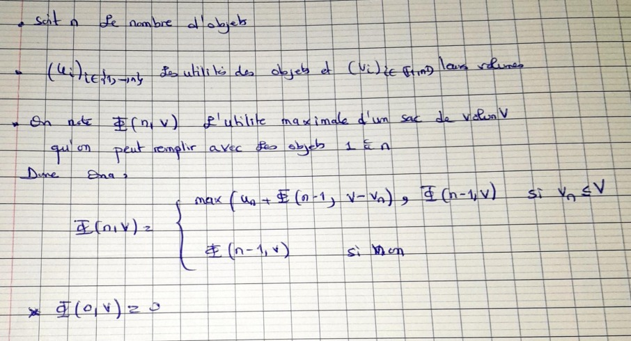

# cour 01 : Pb de sac à dos `Knapsack`


### 1. Présentation du Pb : sac à dos biniare 


- Supposons que vous ayez un sac à dos avec une capacité maximale C et une liste de n objets.

- chaque objet $i$ ayant un volume $v_i$ et une valeur $u_i$. 

- L'objectif est de déterminer la meilleure combinaison d'objets à placer dans le sac de manière à maximiser la valeur totale, tout en respectant la capacité de poids maximale du sac.


- **écriture mathématique du pb :** 

soit $x_i \in \{0,1\}$ tq $x_i = 1$ ssi l'objet $i$ est mis dans la sac .

donc le probélme de sac à dos binaire s'écrit :

$$
\begin{align}
    max \sum_{i=1}^{n}u_i x_i \\
    \sum_{i=1}^{n}v_i x_i &\leq C
\end{align}
$$


### 2. équation de Bellman :

- L'équation de Bellman est un concept clé en programmation dynamique, utilisé pour définir la relation récursive qui permet de résoudre un problème d'optimisation en le décomposant en sous-problèmes plus petits.

- équation de bellman dans le pb de sac à dos :




### 3. Algo de résolution

### 4. Compléxite et localité 


**Problème du sac à dos (0/1 Knapsack Problem) :**


**Équation de Bellman :**
L'équation de Bellman est la base de la programmation dynamique pour résoudre le problème du sac à dos. Elle est formulée comme suit :

```
DP[i][w] = max(DP[i-1][w], DP[i-1][w - wi] + vi)
```

où :
- DP[i][w] représente la valeur maximale pouvant être obtenue en utilisant les i premiers objets et en ayant une capacité maximale de poids w.
- DP[i-1][w] est la valeur maximale obtenue sans inclure le i-ème objet.
- DP[i-1][w - wi] + vi est la valeur maximale obtenue en incluant le i-ème objet.

**Résolution en Bottom-up :**
La résolution du problème du sac à dos en utilisant une approche bottom-up implique la création d'un tableau (généralement une matrice) pour stocker les résultats intermédiaires et la résolution progressive des sous-problèmes. Voici un exemple en Python :

```python
def knapsack_bottom_up(values, weights, W):
    n = len(values)
    DP = [[0] * (W + 1) for _ in range(n + 1)]

    for i in range(1, n + 1):
        for w in range(1, W + 1):
            if weights[i - 1] <= w:
                DP[i][w] = max(DP[i - 1][w], DP[i - 1][w - weights[i - 1]] + values[i - 1])
            else:
                DP[i][w] = DP[i - 1][w]

    return DP[n][W]

# Exemple d'utilisation
values = [60, 100, 120]
weights = [10, 20, 30]
W = 50
result = knapsack_bottom_up(values, weights, W)
print("La valeur maximale dans le sac à dos est :", result)
```

**Résolution en Top-down (Récursive avec Mémoïsation) :**
La résolution du problème du sac à dos en utilisant une approche top-down commence par une fonction récursive, mais avec une mémoïsation pour stocker les résultats intermédiaires et éviter les recalculs. Voici un exemple en Python :

```python
def knapsack_top_down(values, weights, W, n, memo={}):
    if n == 0 or W == 0:
        return 0

    if (n, W) in memo:
        return memo[(n, W)]

    if weights[n - 1] > W:
        result = knapsack_top_down(values, weights, W, n - 1, memo)
    else:
        result = max(knapsack_top_down(values, weights, W, n - 1, memo),
                     values[n - 1] + knapsack_top_down(values, weights, W - weights[n - 1], n - 1, memo))

    memo[(n, W)] = result
    return result

# Exemple d'utilisation
values = [60, 100, 120]
weights = [10, 20, 30]
W = 50
n = len(values)
result = knapsack_top_down(values, weights, W, n)
print("La valeur maximale dans le sac à dos est :", result)
```

**Complexité :**
La complexité de la méthode bottom-up est généralement O(n * W), où n est le nombre d'objets et W est la capacité maximale du sac à dos. La méthode top-down avec mémoïsation a une complexité similaire, mais elle peut être plus efficace dans certains cas grâce à la réutilisation des résultats intermédiaires.

**Localité :**
La programmation dynamique dans le contexte du problème du sac à dos présente une forte localité, car les solutions aux sous-problèmes sont stockées et réutilisées dans le tableau/mémoïsation, ce qui réduit considérablement la duplication des calculs. Cela contribue à améliorer l'efficacité de l'algorithme.