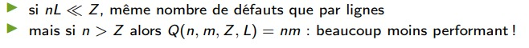

# cour : Localité et Modéle CO :

## 1. **Introdction :**

### 1.1 : **Une petite introduction:**

- Quand le processeur veut lire ou écrire une donnée, il va d'abord vérifier si celle-ci est dans **la mémoire cache**. Si c'est le cas, alors il va lire ou écrire dans le cache, ce qui sera très rapide. Mais dans le cas contraire, il devra aller chercher les données à lire ou écrire dans la mémoire : ce sera des centaines de fois plus lent que l'accès au cache et les performances s'effondreront.

- Dans ces conditions, plus on limite le nombre de **cache miss** (les situations où la donnée n'est pas dans le cache), meilleures sont les performances. Et à ce petit jeu, gérer correctement le cache est une nécessité.


### 1.2 **QQ Définitions:**

- **La mémoire cache:** 
    
    - est une mémoire de petite taille et très rapide utilisée dans un ordinateur pour stocker temporairement des données fréquemment utilisées, afin d'accélérer l'accès à ces données par le processeur.

    - Elle agit comme un tampon entre le processeur et la mémoire principale (RAM). 
    
    - Lorsque le processeur a besoin d'accéder à des données ,il vérifie d'abord la mémoire cache.:
        
        - Si les données sont présentes dans la mémoire cache (ce qu'on appelle un **hit de cache** ), le processeur peut accéder à ces données plus rapidement 
        
        - Si les données ne sont pas dans la mémoire cache (ce qu'on appelle un **miss de cache** ), le processeur récupère alors les données depuis la mémoire RAM principale et les place dans la mémoire cache pour un accès plus rapide ultérieur.


    - **La mémoire cache** est organisée en plusieurs niveaux (L1, L2, L3, etc.), avec différentes tailles et vitesses. Les niveaux de cache les plus proches du processeur (comme le cache L1) sont plus petits mais très rapides, tandis que les niveaux de cache plus éloignés du processeur (comme le cache L3) sont plus grands mais plus lents en termes d'accès.

- **localité:**

    - La **localité**  fait référence à la tendance des programmes informatiques à accéder fréquemment à des emplacements de mémoire spécifiques pendant leur exécution. 
    
    - De manière générale, on distingue deux types de localité :

        1. **Localité spatiale :**  fait référence à la tendance d'un programme à accéder à des emplacements de mémoire voisins ou adjacents au fil du temps. Par exemple, lorsque des données sont utilisées, il est fréquent que les données voisines ou proches soient également utilisées peu de temps après.

        2. **Localité temporelle :** La localité temporelle signifie que si une zone de mémoire est référencée à un instant donné, il est probable qu'elle le sera à nouveau dans un avenir proche. Les données qui ont été accédées récemment ont tendance à être réutilisées dans un court laps de temps.


- **Hiérarchie mémoire :**


### **RQ:**

- Dans le contexte de ``la mémoire cache``, l'unité de transfert de données entre la mémoire principale et la mémoire cache est appelée ``ligne de cache`` ou ``bloc de cache``.


- **Un bloc de cache** est l'unité de données la plus petite que la mémoire cache peut transférer de la mémoire principale (RAM) vers la mémoire cache, ou vice versa. 

- Lorsque le processeur accède à une adresse mémoire, l'unité de données associée à cette adresse, ainsi que des données adjacentes, est transférée de la mémoire principale vers la mémoire cache.

- Les blocs de cache sont stockés dans des emplacements de la mémoire cache appelés **ensembles** ou **lignes de cache**. 


- La taille d'un bloc de cache est déterminée par l'architecture spécifique du processeur et peut varier. Les tailles de bloc de cache courantes sont de 64 octets, 128 octets, voire plus, mais cela dépend du processeur et de son architecture. 


## 2. **les défauts de caches:**

- **Définition:**

    - Les **défauts de cache** se produisent lorsqu'un processeur  tente d'accéder à des données qui ne sont pas présentes dans la mémoire cache. 
    
    - Lorsqu'un programme ou une tâche nécessite des données qui ne se trouvent pas dans la mémoire cache, cela génère un **défaut de cache** ou **cache miss**. 
    

- **Types de défauts de cache :**

    1. **Défauts de cache obligatoires:** Ces défauts se produisent lors du lancement d'un programme, où aucune des données requises n'est présente dans la mémoire cache. 
        

    2. **Défauts de cache capacitifs :** 
        
        - Ces défauts de cache se produisent lorsque la mémoire cache n'est pas suffisamment grande pour contenir toutes les données nécessaires à un moment donné. 
        
        - Ils sont le résultat d'une limitation de capacité de la mémoire cache. Même si les données ont été utilisées récemment, si la mémoire cache est pleine et que de nouvelles données doivent être chargées, certaines données existantes dans la mémoire cache doivent être évacées de la cache  pour faire de la place. 
        
- **la politique de Remplacement `LRU`:**

    - La politique de remplacement ``LRU`` (Least Recently Used) est une stratégie utilisée dans la gestion des caches pour décider quel élément de données remplacer lorsqu'un nouveau bloc de données doit être chargé dans un emplacement de cache qui est déjà plein.

    - Le principe de la politique de remplacement LRU consiste à évincer le bloc de données qui n'a pas été accédé depuis le plus longtemps. Autrement dit, parmi les données stockées en cache, celle qui a été utilisée le moins récemment sera évincée pour faire de la place à de nouvelles données.

    - Cette stratégie repose sur l'hypothèse que les données qui ont été moins fréquemment utilisées dans le passé auront moins de probabilités d'être réutilisées à l'avenir. 

- **mesure de défautes de cache : l'outil ``cachegrind``:**

    - ``cachegrind`` est un outil d'analyse de performances fourni par ``valgrind`` , conçu spécifiquement pour l'analyse du comportement du cache d'un programme.

    - Il utilise une simulation des caches pour collecter des statistiques détaillées sur l'accès à la mémoire et le comportement du cache pendant l'exécution d'un programme. Parmi les informations collectées, on trouve :

        - **Les défauts de cache :** Le nombre de fois où une donnée doit être chargée depuis la mémoire principale car elle n'était pas présente dans le cache.
        - **L'utilisation du cache :** Le pourcentage d'utilisation du cache par le programme.
        - **Les statistiques sur les accès mémoire :** Informations détaillées sur la façon dont le programme accède à la mémoire.

    - pour l'utiliser cachegrind : 

        ```shell
        valgrind --tool=cachegrind ./votre_programme

        ```
    - **Exemple:**
        

## 3. **Analyse théorique : ``Modéle CO``**


- Le modèle CO (Cache Organization Model) est une approche théorique utilisée pour analyser les défauts de cache dans les architectures de mémoire cache des processeurs. 

- Ce modèle est un cadre abstrait qui permet de comprendre et d'évaluer les performances du cache en se basant sur des hypothèses et des mécanismes idéalisés.


- **Modélisation du cache dans le Modéle CO:**
    
    


- **Hypothéses du modéle:**  
        
    - *Simplification* : hiérarchie à 1 niveau seulement 
    
    - **politique de raplacement :** politique LRU
        
    - **Paramètres** : 
        
        - Z = taille cache 
        - L = taille ligne de cache

        - ``Q(n, L, Z)`` = nombre de transferts de blocs (n=taille instance)
        

    - **Hypothèse** : Z >> L en général : Z = $\Omega(L^2)$


- **Objectif :** programme qui minimise ``Q(n, L, Z)`` [pour tout L et Z] . 


## 4. **Application du Modéle CO:**

### 4.1 **Parcour d'un tableau 1D:**

- **Modèle CO** : 
    - cache de taille Z octets, 
    - chargé par lignes de L octets
    - politique de remplacement des lignes dans le cache : LRU

- On parcourt  T[0..n − 1] tableau  de n octets stockés consécutivement en mémoire :

    

- **programme:**

    ```c
    for(int sum=T[0] , i=1 , i < n , ++i)
    {
        sum += T [i ];
    }
    
    ```


- **calcul de nombre de défauts de caches:**

$Q(n,L,Z) =  \lceil \frac{n}{L} \rceil$


### 4.2 **dichotomie (Binary search):**

- **Modèle CO** : 
    - cache de taille Z octets, 
    - chargé par lignes de L octets
    - politique de remplacement des lignes dans le cache : LRU

- on cherche de calculer le nombre de défauts de   l'algo de ``Binary search`` dans le modéle CO .

- **programme:**

```c
T* binarySearch( T * begin , T* end , T * val )
{ 
    T* mid = begin + ( end - begin ) /2 ;
    while ( begin < end )
    { 
        switch ( cmp ( mid , val ) )
        { 
            case LESSER : 
                begin = mid +1 ; 
                break;
            case GREATER : 
                end = mid -1 ; 
                break;
            
            case EQUAL : 
                return mid ;
        } 
    }
    
    return NULL ;
}

```


- le nombre de défauts de caches est : $Q(n,L,Z) = log_2(\frac{n}{L})$


### 4.3 **parcours d’une matrice:**


- **row major:**
    
    -   En programmation, lorsque les données sont stockées dans un tableau multidimensionnel en  réalite dans le mémoire le stockage des donées est ligne  par ligne (row-major order), cela signifie que les éléments dans la mémoire sont organisés par lignes successives.

    - **exemple:**
        - En C/C++, python, java, rust, ... : stockage par lignes (row major) A[...][k − 1], A[...][k], A[...][k + 1] sont stockés consécutivement.


-  on cherche de calculer le nombre de défauts d'un programmme qui parcourir une matrice (parcour simple) dans le modéle CO .

- Soit ``A`` une matrice ``n × m`` avec ``n`` lignes et ``m`` colonnes.


- **programme :**

```c

// parcour ligne par ligne :
for(int i = 0 ; i<n ; i++)
{
    for(int j = 0 ; j<m ; j++)
    {
        A[i][j] = i+j ;
    }
}


// parcour colonne par colonne :
for(int j = 0 ; j<m ; j++)
{
    for(int i = 0 ; i<n ; i++)
    {
        A[i][j] = i+j ;
    }
}

```

- **Analyse des défauts de cache:**

    - **parcour ligne par ligne :**  

        

    - **parcour colonne par colonne:**  

        


### 4.4 **Transposition de matrice:**


- **modéle CO:**
    - cache de taille Z octets, 
    - chargé par lignes de L octets
    - politique de remplacement des lignes dans le cache : LRU

- matrices sont st-ockées par **row major**


-  on cherche de calculer le nombre de défauts d'un programmme qui calcul la transpose d'une matrice  dans le modéle CO .


- **programme:**

```c
for(int i =0 ; i<n  ; i++)
{
    for(int j = 0 ; j<m ; j++)
    {
        B[j][i] = A[i][j];
    }
}

```

- **Analyse des défauts de cache:**

