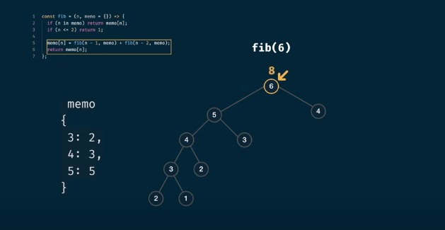
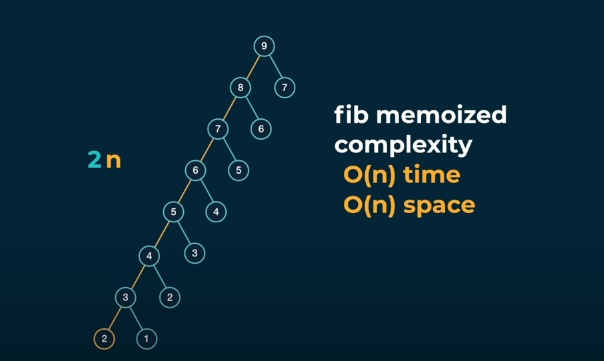

# Problème 0 : suite de Fibonacci

## 1. Présentation :

- Le problème de la suite de Fibonacci est un problème classique en informatique et en mathématiques. 

- La suite de Fibonacci est définie comme suit :

$$F(n) = F(n-1) + F(n-2)$$

avec les conditions de base :

$$F(0) = 0$$
$$ F(1) = 1$$

Le problème consiste à calculer la valeur de $F(n)$ pour un certain  $n$ .


## 2. Prog. récursif naïf  :

- **programme:**
 
```python
def fibo(n):
    if n < 2 :
        return n
    else :
        return fibo(n-1)+fibo(n-2)
    

print(f"fibo(5) = {fibo(5)}")
print(f"fibo(10) = {fibo(10)}")
print(f"fibo(50) = {fibo(50)}")

```
- **compléxite:**

L'algorithme de Fibonacci naïf , a une complexité exponentielle. Plus précisément, la complexité temporelle est 
$O(2^n)$, ce qui signifie que le temps d'exécution augmente de manière exponentielle avec la taille de l'entrée.


## 3. Programme avec mémorisation :

- **programme:**

```python
def fibonacci(n, memo={}):
    if n in memo:
        return memo[n]

    if n < 2 :
        return n 

    memo[n] = fibonacci(n - 1, memo) + fibonacci(n - 2, memo)
    
    return memo[n]

```




- **complexité:**



