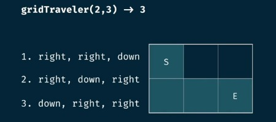
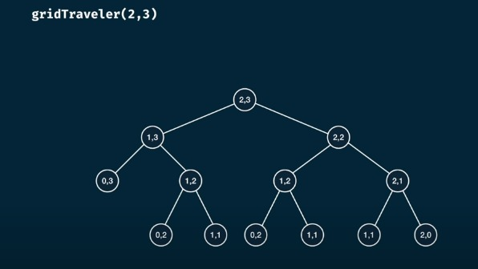

# Probléme 04 : **`grid travel`**


## 1. Déscription :


**Énoncé :**

- Considérons une grille  m xn  (m lignes, n colonnes). Un voyageur est situé dans le coin supérieur gauche de la grille à la position (0,0), et l'objectif est d'atteindre le coin inférieur droit à la position (m-1,n-1). Le voyageur ne peut se déplacer qu'en bas ou à droite.

- L'objectif est de compter le nombre total de façons différentes pour le voyageur d'atteindre le coin inférieur droit.

**Exemple :**



Il y a 3 façons différentes pour le voyageur d'atteindre le coin inférieur droit.


## 2.  Prog. récursif naïf:


- **programme:**

```python

def grid_travel_naive(m ,n):

    if n==1 and m==1 :
        return 1 
    if n==0 or m==0 :
        return 0 
    
    return grid_travel_naive(m-1,n)+grid_travel_naive(m , n-1)

```





- **complexité:**


## 3. **Solution avec la programmation dynamique :**


- La résolution de ce problème en utilisant la programmation dynamique consiste à diviser le problème en sous-problèmes plus petits et à utiliser la mémorisation pour éviter de recalculer les résultats déjà obtenus.

- **programme :**

```python
def grid_traveler(m, n, memo={}):
    key = (m, n)
    
    if key in memo:
        return memo[key]
    
    if m == 1 and n == 1:
        return 1
    
    if m == 0 or n == 0:
        return 0
    
    memo[key] = grid_traveler(m-1, n, memo) + grid_traveler(m, n-1, memo)
    return memo[key]

# Exemple d'utilisation
result = grid_traveler(2, 3)
print(result)  # Affiche 3
```
