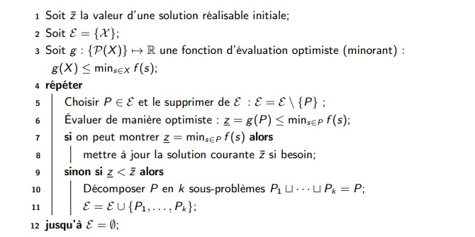

# cour 17 : Branch and Bound 

## 1. Principe :

-  **Branch and Bound** est une technique algorithmique utilisée pour résoudre de manière optimale des problèmes d'optimisation combinatoire. 

- il s'agit aussi d'une Méthode de résoluton d’un pb d’optimisation par exploration.

- Le principe de **Branch and Bound** fonctionne de la manière suivante :

1. **Initialement** : on part d’une solution connue (non optimale a priori)

2. **Branch** : exploration top-down (arborescente) de l’espace des solutions découper un problème en sous-problèmes plus petits

    - Le problème d'optimisation initial est divisé en sous-problèmes plus petits. Cela est fait en identifiant des choix ou des décisions qui peuvent être pris à différents niveaux de l'arborescence de recherche. Chaque choix possible conduit à une branche distincte de l'arbre de recherche.

 
3. **Bound** : inutile d’explorer un sous-arbre qui ne peut pas améliorer la solution courante

    - Pour chaque nœud de l'arbre de recherche, une borne supérieure (ou inférieure, selon le type de problème) est calculée. Cette borne permet de déterminer si la branche en cours peut potentiellement contenir une solution meilleure que la meilleure solution trouvée jusqu'à présent. Si la borne montre que la branche ne peut pas contenir une solution meilleure, cette branche est ignorée.

### RQ :

la méthode Branch and Bound est une approche générale qui peut être utilisée pour résoudre différents types de problèmes, pas seulement des problèmes d'optimisation. Bien que son application la plus courante soit dans le domaine de l'optimisation combinatoire, elle peut également être adaptée à d'autres types de problèmes comme **Recherche de chemins** , **Arbre de décision** , **Planification de tâches** et couramment utilisée dans la résolution de Problèmes Linéaires en Nombres Entiers **PLNE**,

## 2. Méthode En pratique : 

les étapes générales de l'algorithme **Branch and Bound**  en pratique :

1. **Initialisation :** 
    
    - Définissez une solution partielle initiale et initialisez une borne supérieure (meilleure solution actuelle) avec une valeur très grande. 
    
    - Créez une file de priorité pour stocker les sous-problèmes.

2. **Boucle principale :** 
    
    - Tant que la file de priorité n'est pas vide :
        a. Retirez le prochain sous-problème de la file de priorité.
        b. Vérifiez s'il est possible d'élaguer le sous-problème (la borne inférieure est plus grande que la borne supérieure actuelle).
        c. Si le sous-problème ne peut pas être élagué, divisez-le en sous-problèmes plus petits (branchement).
        d. Mettez à jour la file de priorité avec les nouveaux sous-problèmes.

3. **Terminaison :** L'algorithme se termine lorsque la file de priorité est vide.

4. **Résultat :** La meilleure solution trouvée est la solution partielle associée à la meilleure borne supérieure.

